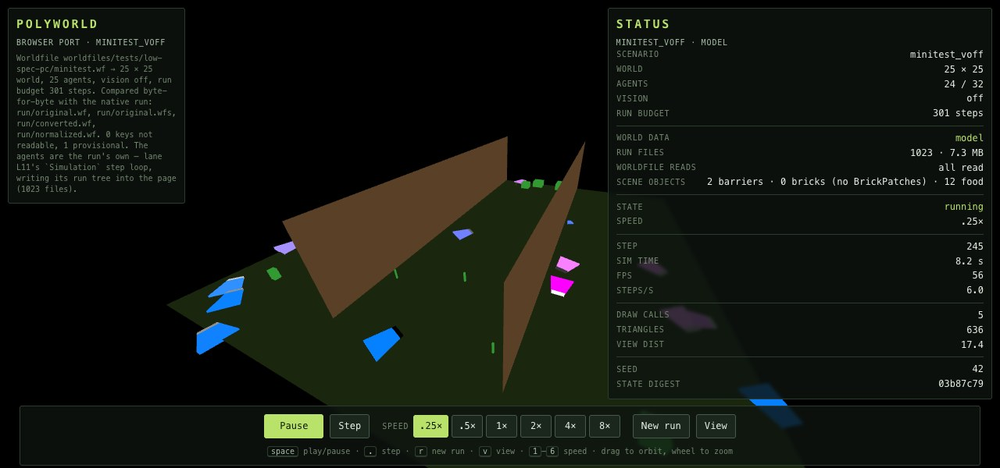
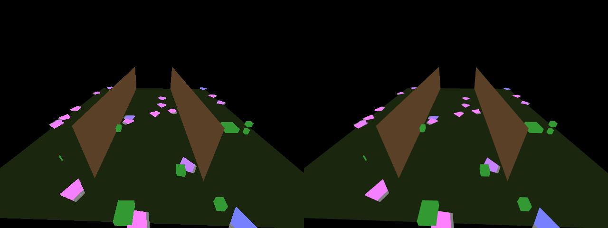
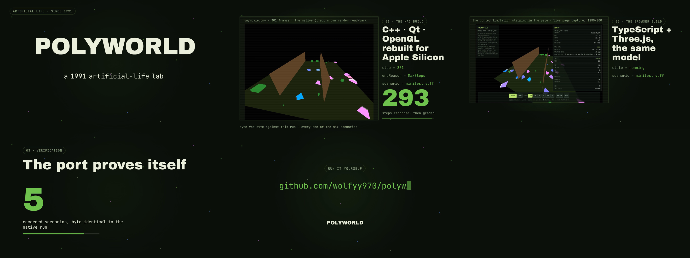
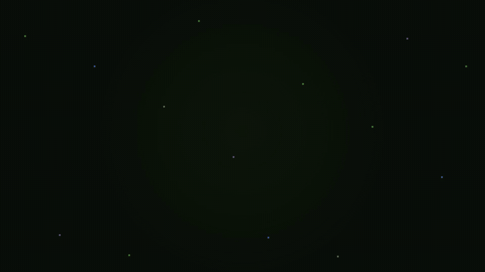

<div align="center">

# Polyworld, ported to the browser

**The 1990s artificial-life simulator — rewritten in TypeScript + Three.js, and graded file-for-file against the original C++ build.**

[▶ Watch the 30-second tour](docs/media/polyworld-ports.mp4) · [the original project](https://github.com/polyworld/polyworld)



</div>

## What this is

[Polyworld](https://github.com/polyworld/polyworld) is an artificial-life system: agents
with evolvable neural brains, genomes, metabolism, vision and reproduction, living in a
shared world of food patches and barriers, competing and evolving.

This port — the `web/` tree of this fork — is a **full re-implementation of the model** — brains, genetics,
metabolism, vision, environment, logging — in TypeScript, drawn with Three.js and stepping
in the browser page itself. It is not a viewer wrapped around the original: every step is
the port's own, and the port writes **the same run tree the original writes** — the same
artifacts, the same logs, the same bytes.

The original build is kept as the **differential oracle**. Every scenario the port
produces is compared, byte-for-byte, with the same scenario recorded from the native
executable. That comparison, not eyeballing, is the compatibility contract.

## The parity claim

All six recorded scenarios match the native runs **file-for-file** — `differing = 0`,
`missing = 0`, `extra = 0`:

| scenario          | exercises                          | artifacts matching |
| ----------------- | ---------------------------------- | ------------------ |
| `hello`           | the 192-agent onboarding world     | 19 / 19            |
| `microtest_voff`  | small world, vision off            | 225 / 225          |
| `minitest_voff`   | 301 steps, vision off (the workhorse) | 1369 / 1369     |
| `microtest_von`   | small world, vision on             | 225 / 225          |
| `minitest_von`    | 301 steps, vision on               | 1308 / 1308        |
| `minitest_adami`  | Adami-complexity instrumentation   | 1373 / 1373        |

The single excluded artifact is `run/movie.pmv`, the recorded movie — the original itself
does not reproduce it between two runs on the same machine, which is documented in
[PARITY.md](PARITY.md) along with the full evidence trail.

## The render is faithful too



*Left: the original C++ build. Right: the port. Same scenario, matched camera — ground,
barriers, food and agent colours identical, and the run trees byte-identical as well.
The only differences are anti-aliasing (WebGL MSAA on; native has none) and one 1-px
wall-top line, both recorded as deliberate in PARITY.md.*

## Run it

```bash
npm install
npm run dev          # → http://localhost:5173
```

Controls: **Pause / Step**, speeds `.25×–8×`, **New run**, **View** (also: `space` play/pause,
`.` step, `r` new run, `v` cycle view, `1–6` speed, drag to orbit, wheel to zoom).

Pick a scenario with a URL parameter, e.g. `?scenario=minitest_von` — the six recorded ones
are `hello`, `microtest_voff`, `microtest_von`, `minitest_voff`, `minitest_von`,
`minitest_adami`.

## Verify it

```bash
npm run typecheck        # tsc, clean
npm test                 # 758 passing, 1 skipped
./oracle/run_parity.sh   # re-run the scenarios and compare against the golden native runs
```

The oracle harness runs each scenario through the port, then compares the entire run tree
against `oracle/<scenario>/` — files, compressed payloads, and logs. Re-recording goldens
requires the native build (macOS; see [PARITY.md](PARITY.md) and `tools/record_oracle.py`).

## How it stays faithful

- **The run tree is the contract.** Composition, fitness, genomes, brains, energy, the
  monitor logs: all of it is compared byte-for-byte, not sampled.
- **Vision is model, not decoration.** Agents' retinas are rendered and read back as their
  sensory input; the vision-on scenarios keep that path honest.
- **Seeded, deterministic RNG** (the original's Mersenne Twister, ported) plus explicit
  float-semantics discipline; two runs of the port agree bit-for-bit.
- **Deliberate decisions are marked.** Anything that had to differ for a modern
  environment is annotated `PORT-NOTE` in the source, with its reasoning.
- **The display layer is presentation.** The Three.js scene is deliberately outside the
  frozen surface — what the *simulation* sees is what is graded.

## Repository layout

```
src/model/     the simulation — agents, brains, genomes, metabolism, vision,
               environment, monitoring/logs, worldfile expression language
src/browser/   the page — boot, worldfile reading, Three.js scene, UI, in-page run tree
oracle/        golden native runs + the parity harness (run_parity.sh)
tools/         recorders, worldfile tooling, perf benches, probes
docs/          specs (simulation, vision, worldfile) + media
```

The full port specification lives in [PORT_SPEC.md](PORT_SPEC.md); the verification record
in [PARITY.md](PARITY.md).

## The 30-second tour

[](docs/media/polyworld-ports.mp4)



*(the video: native build → browser build → the parity result; it ships with the repo at
[`docs/media/polyworld-ports.mp4`](docs/media/polyworld-ports.mp4))*

## Visual parity (native ↔ browser)

The browser scene is held to the native renderer as its contract (PORT_SPEC → *The render is a
fidelity surface*). Same simulation step, same camera — native Polyworld C++ on the left, the
browser port on the right:


## Credits & license

- **Polyworld** was created by Larry Yaeger and contributors; the original project lives at
  [github.com/polyworld/polyworld](https://github.com/polyworld/polyworld). This port stands
  entirely on that work — the oracle *is* their build.
- License: the original is distributed under the **Apple Public Source License 2.0** (see
  the original repository's `LICENSE.txt`). This repository is a derivative work of it and
  follows the upstream licensing terms; keep the upstream notices intact when redistributing.
